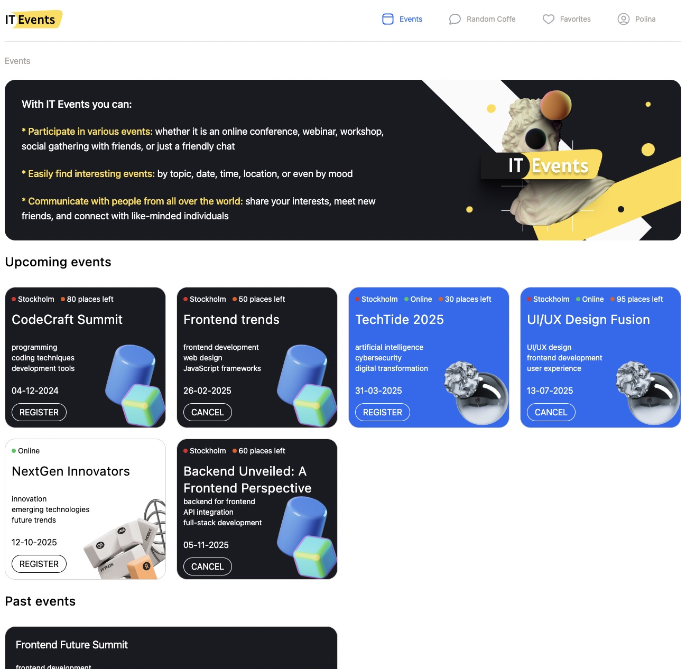
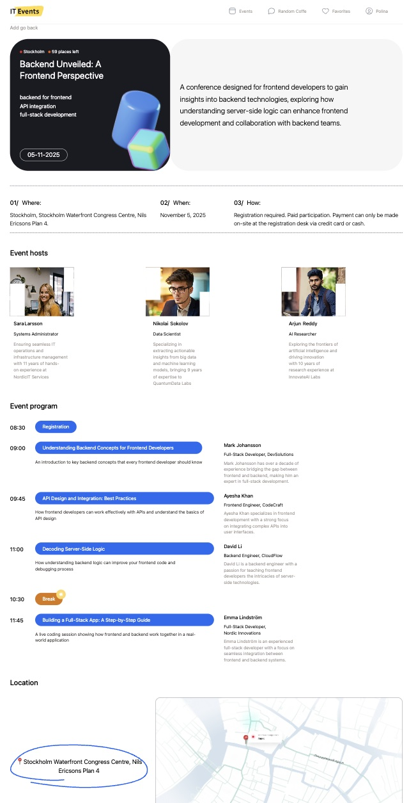
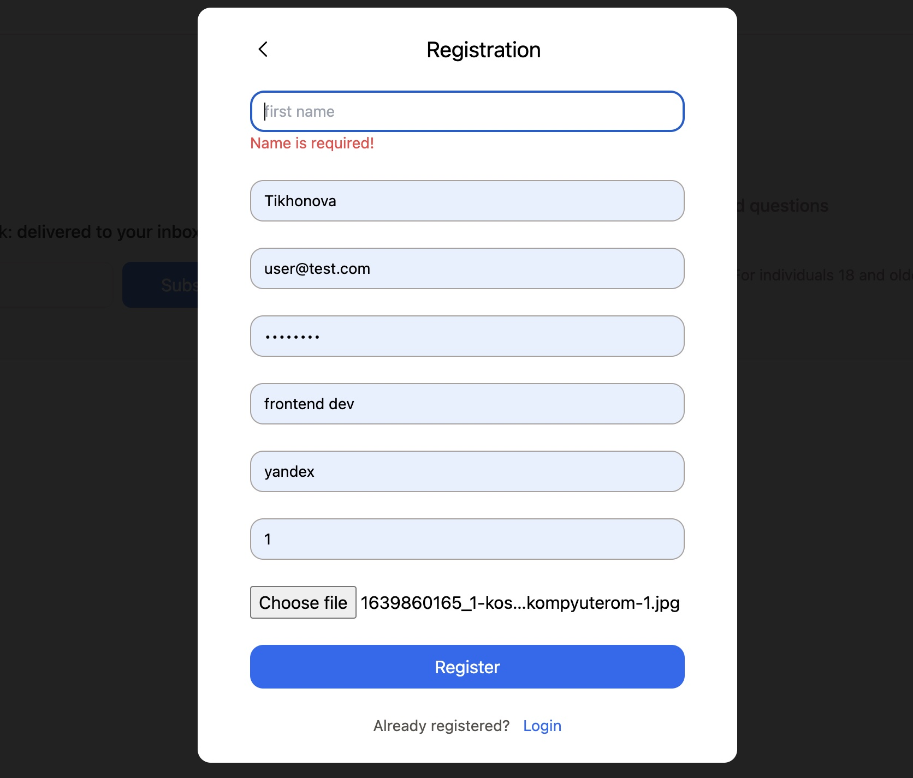
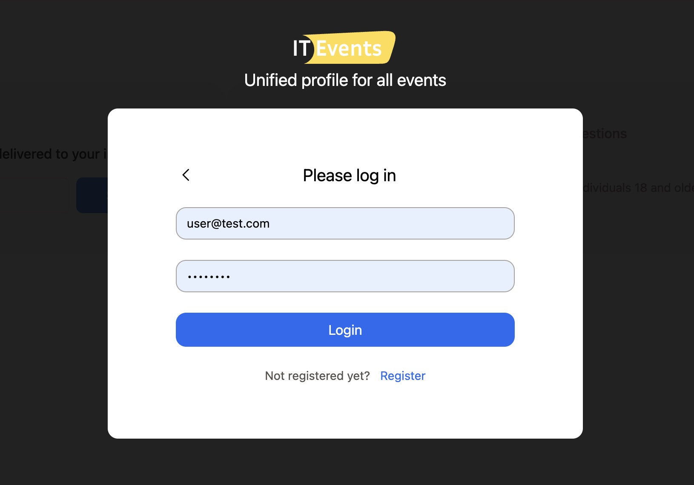

# IT-Events Web Application, Desktop Version, Frontend and Backend.
Individual Diploma Project as part of studies at Hyper Island.

***This is a web service for online and onsite events in the IT sphere.*** 

As a user, you can:
* Register on the platform;
* View the list of upcoming events and the number of available onsite spots;
* Explore detailed information about the event, such as the agenda, hosts, speakers, and location;
* Register for an event or cancel your registration;
* View the events you’ve registered for in your profile.
* In the future, I plan to add a "Random Coffee" section where users can find friends with similar interests and chat with them.

## Tools and stack: 
* HTML / React / TypeScript / NodeJS /  REST API / JWT / Sequelize / PostgreSQL / Tailwind CSS
  
## Here's what was done:
### Backend: 
* Connected to a PostgreSQL database using Sequelize ORM, designed the schema, and created data models.
* Routing & Endpoints:
  > * Event Routes: Create, Delete, Get all, Get one
  * User Routes: Registration, Login, Profile update, Delete
  Host Routes: Create, Edit, Delete
  Event Registration Routes: Register, Cancel, View all subscriptions
* Error Handling: Implemented global error handling for consistent error responses and logging.

### Frontend:
* Created REST API requests to interact with the backend.
* Developed the following pages:
Home Page: Displays upcoming and past events.
Profile Page: Shows user data and saved events.
Event Details Page: Provides detailed information about a specific event.
Auth Forms: Registration and login forms.
* Implemented user registration and cancellation for events.
* Implemented route protection to restrict access to certain pages.

## Project links:
### Website: [Visit website]()

## Project screenshots:
***Start page***

***Dashboard page***

***Registration form***

***Login form***

***Profile page***

## Project Setup Instructions:
To set up this project locally, follow the steps below:

