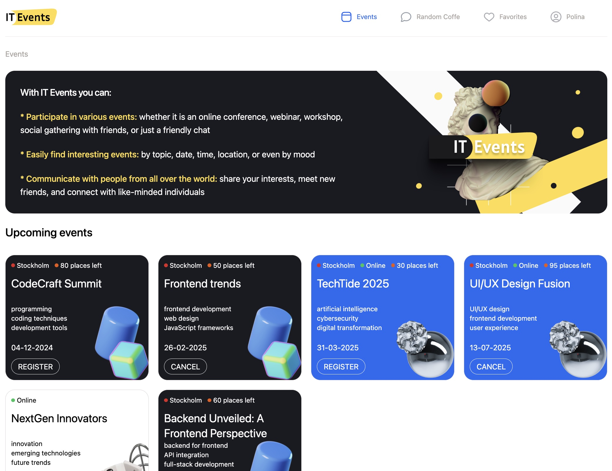
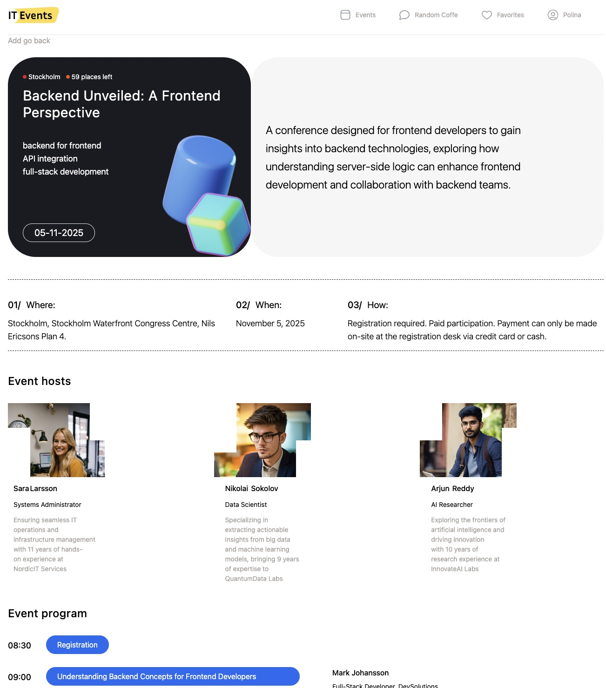
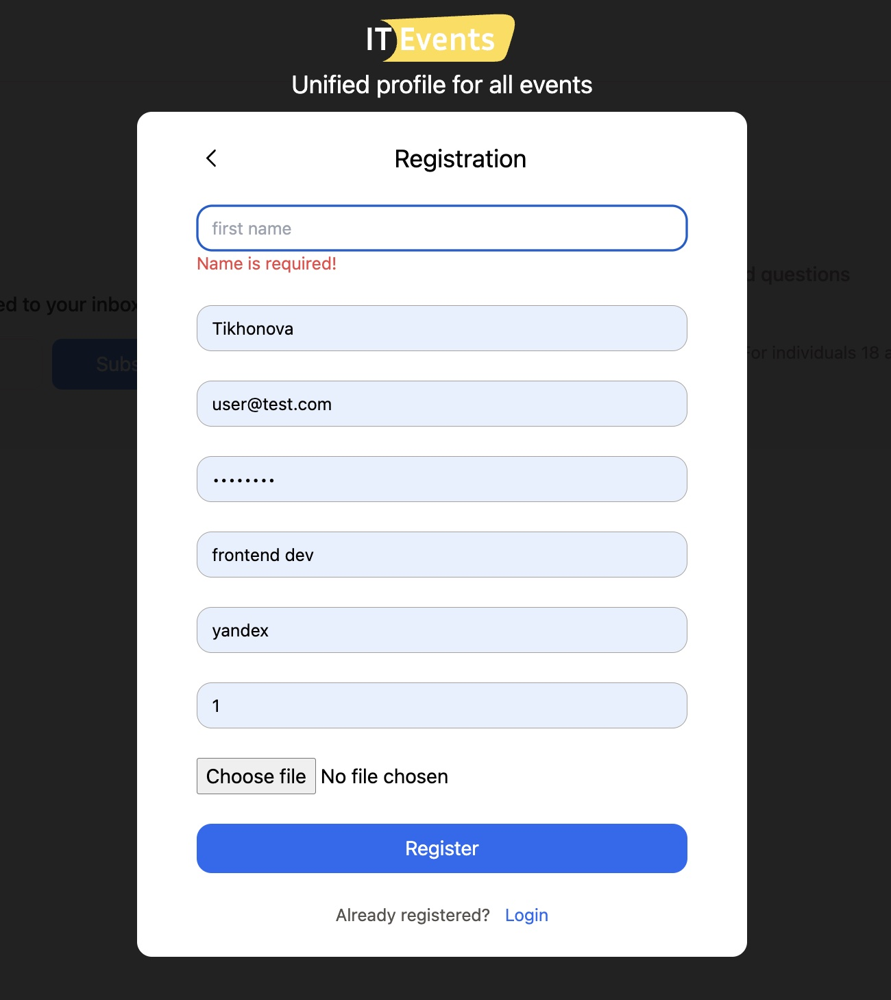
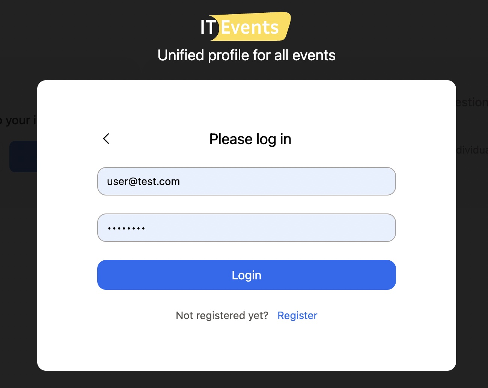

# IT-Events Web Application, Desktop Version, Frontend and Backend.
Individual Diploma Project as part of studies at Hyper Island.

***This is a web service for online and onsite events in the IT sphere.*** 

As a user, you can:
* Register on the platform;
* View the list of upcoming events and the number of available onsite spots;
* Explore detailed information about the event, such as the agenda, hosts, speakers, and location;
* Register for an event or cancel your registration;
* View the events you’ve registered for in your profile.
* In the future, I plan to add a "Random Coffee" section where users can find friends with similar interests and chat with them.
<br>

## Tools and stack: 
* HTML / React / TypeScript / NodeJS /  REST API / Express / JWT / Sequelize / PostgreSQL / Tailwind CSS
<br>
  
## Here's what was done:
### Backend: 
* Connected to a PostgreSQL database using Sequelize ORM, designed the schema, and created data models.
* Routing & Endpoints:
  * Event Routes: Create, Delete, Get all, Get one
  * User Routes: Registration, Login, Profile update, Delete
  * Host Routes: Create, Edit, Delete
  * Event Registration Routes: Register, Cancel, View all subscriptions
* Error Handling: Implemented global error handling for consistent error responses and logging.

### Frontend:
* Created REST API requests to interact with the backend.
* Developed the following pages:
  * Home Page: Displays upcoming and past events.
  * Profile Page: Shows user data and saved events.
  * Event Details Page: Provides detailed information about a specific event.
  * Auth Forms: Registration and login forms.
* Implemented user registration and cancellation for events.
* Implemented route protection to restrict access to certain pages.
<br>

## Project links:
### Website: [Visit website]()
### GitHub: [Visit repository](https://github.com/hyper-island-diploma-project/it-events)
<br>

## Project screenshots:

***Start page***
<br>
>

***Event page***
<br>
>


***Registration form***
<br>
>

***Login form***
<br>
>

***Profile page***
<br>
>

<br>

## Project Setup Instructions:
To set up this project locally, follow the steps below:

1. **Clone the Repository:**

    ```bash
    https://github.com/hyper-island-diploma-project/it-events.git
    ```
3. **Navigate to the Server folder:**

    ```bash
    cd server
    ```
4. **Running the api (backend part):**
   
    ```bash
    npm run dev
    ```
5. **Open a new terminal window. Navigate to the Client folder:**

    ```bash
    cd client
    ```

6. **Install client dependencies:**

    ```bash
    npm install
    ```
7. **Running the frontend part:**

    ```bash
    npm run dev
    ```    

8. **Open web site locally**

Now you can interact with the web service.

